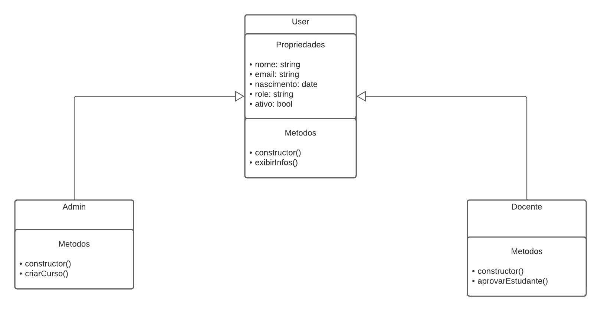

# fundamentos_POO_JS

## Este projeto tem o intuito de apresentar alguns conceitos básicos de POO voltado para linguagem JavaScript.

### Cada Branch apresenta arquivos com comentários relacionados aos assuntos:
- Objeto Literal
- Classes
- Heranças
- Polimorfismo
- Conceitos do design pattern SOLID

### O repositório foi baseado no seguindo modelo UML:

